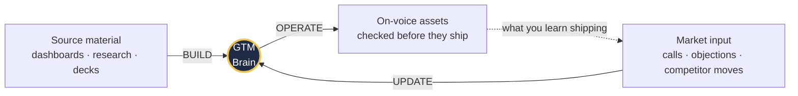
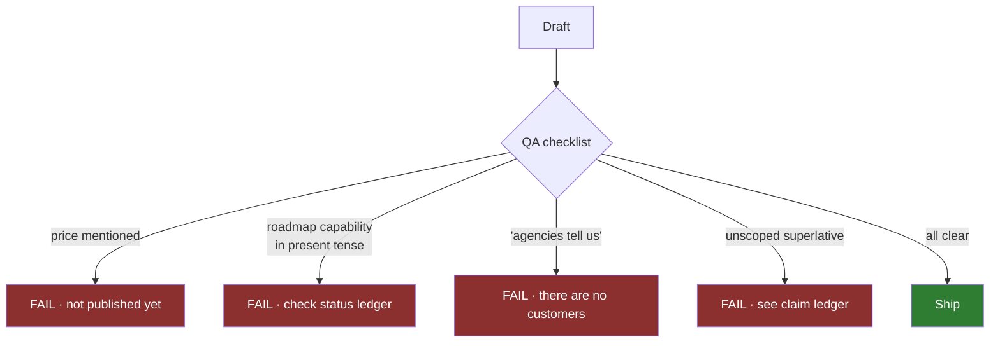
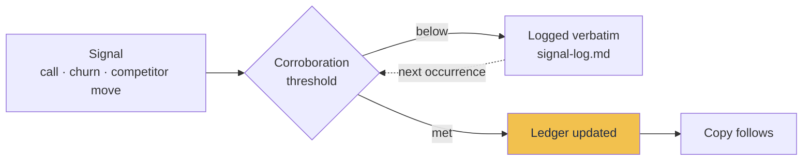
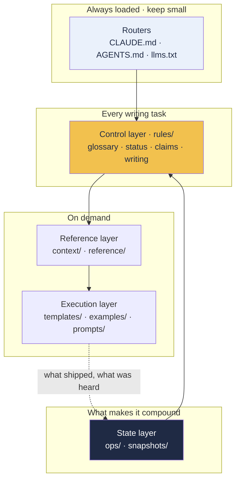

# Health Plan Chat — Go-to-Market Brain

**One repository that holds an entire go-to-market in a form any AI agent can execute against, and any human can decide from.**

---

It is content and context, not application code. Nothing here is specific to the tool that built
it: it is Markdown, and any agent that can read a file can be pointed at it.

## What Health Plan Chat is

A consumer-facing AI voice and chat agent for independent Medicare insurance agencies, trained on
the specific Medicare plans each agency sells.

A beneficiary calls the agency's own number at nine on a Sunday and asks what their dental
allowance is. The agent answers from that agency's carrier documents, in the agency's name,
applies the required disclaimers, records the call, and either resolves the question or hands to a
licensed agent with the full conversation attached.

## The sixty-second version

Three modes. **BUILD** turned the Sprint 1 research into this repository, and is done. **OPERATE**
is the daily one: produce something, check it, ship it. **UPDATE** is what stops the whole thing
going stale.

---

## What you can use it for

### 1 · Produce customer-facing work without briefing anyone

Point an agent at the repository and ask for the asset. It already knows the audience, the voice,
the approved claims and the words this brand refuses to use.

| Ask for | It loads | You get back |
|---|---|---|
| A cold outreach sequence | `outbound-engine` · `value-proposition-icp1` · template · approved example | Four touches in house voice, claim-checked |
| A LinkedIn sequence for a downline | `value-proposition-icp2` · template · approved example | Enforceability framing, never the ICP-1 pitch |
| A landing page | `value-proposition-icp1` · `landing-page` template | Nine sections, with the price block correctly absent |
| A comparison page | `competitor-battlecards` · `do-not-say` | Rival's real strength stated first, gaps admitted |
| A community post | `community-post` template | Ungated value, affiliation disclosed |
| A nurture sequence | `nurture-email` template | Two tracks that never merge |

Filled, runnable prompts for each of these live in [`prompts/common-tasks.md`](prompts/common-tasks.md).

### 2 · Settle a strategy question without reopening it

Eight decisions are recorded with their date, the reasoning, and — the part that usually causes the
re-argument — **an explicit note of what each decision did not change**.

> *"Why are we leading on plan grounding instead of setup speed?"*
> → [`reference/positioning-verdict.md`](reference/positioning-verdict.md) has the answer, the
> three reasons, and the counter-argument kept on purpose.

### 3 · Stop an agent, or a hurried human, from overclaiming

This is the part that earns its keep. Health Plan Chat sells into a CMS-regulated market, where an
overclaim is a compliance exposure rather than a marketing error.

Every prohibition in [`rules/do-not-say.md`](rules/do-not-say.md) carries a replacement. A ban with
no alternative gets ignored by whoever is on deadline, and it teaches an agent to route around the
rule rather than obey it.

### 4 · Absorb what the market tells you, instead of forgetting it

Thresholds are set per signal type: three independent occurrences for an objection, one from a lost
deal for a feature request, **one with no threshold at all for anything touching compliance**,
because the cost of being wrong there is not symmetric.

### 5 · Brief a person as fast as a machine

A new contractor, agency, freelance writer or hire reads four files and can produce on-brand work
the same day: the master context, then the three ledgers. No meeting required.

### 6 · Keep a founder's head out of the critical path

Strategy stops living in one person's memory. The twenty most looked-up facts sit in a single
cheatsheet at the end of [the master context](context/HealthPlanChat_GTM_Master_Context.md), so the
common questions never need a full read, and never need the founder.

---

## What you get out of it

| Without a brain | With this one |
|---|---|
| Every asset briefed from scratch | The brief is already written and versioned |
| Claims reviewed one at a time | The scoping was done once, in the claim ledger, with the counter-examples kept |
| Settled decisions re-argued quarterly | Dated, with what they did **not** change recorded |
| Voice drifts per writer and per tool | Two annotated examples act as the reference |
| Market input lives in someone's inbox | Logged, triaged against thresholds, routed to a ledger |
| Each agent tool overclaims differently | One control layer, wired into every tool the team runs |
| Guardrails are a conversation | Guardrails are a checklist, and a script that lints them |

The compounding effect is the point. A style guide is static. This gets sharper every time someone
takes a call.

---

## Where it runs

Four requirements, and any tool meeting them works: text reaches the context window, something
triggers it, files can be opened on demand, and the model follows negative instructions.

### Terminals and CLIs

| Tool | How it loads |
|---|---|
| **Claude Code** | Finds `CLAUDE.md` by itself. Nothing to configure |
| **OpenAI Codex** | Reads `AGENTS.md` at the repo root |
| **Gemini CLI** | Copy [`adapters/GEMINI.md`](adapters/GEMINI.md) to `GEMINI.md` |
| **Aider · Cline · Roo · Continue · opencode** | All read `AGENTS.md` |

### Editors and IDEs

| Tool | How it loads |
|---|---|
| **Cursor** | Copy [`adapters/cursor.mdc`](adapters/cursor.mdc) to `.cursor/rules/` |
| **Windsurf** | Copy [`adapters/windsurf.md`](adapters/windsurf.md) to `.windsurf/rules/` |
| **GitHub Copilot** | Copy [`adapters/copilot-instructions.md`](adapters/copilot-instructions.md) to `.github/` |
| **Zed** | Reads `AGENTS.md` |

### Chat windows, with no file access at all

ChatGPT, Grok, Gemini in the browser, a custom GPT, or any assistant with a system-prompt field:
paste [`adapters/portable-control-layer.md`](adapters/portable-control-layer.md). It carries the
content rather than pointers, because a chat model cannot follow a pointer. It is dated, and gets
regenerated whenever a ledger changes.

### Everywhere else

- **Your own agent framework** — read the files in the order `AGENTS.md` names. It is Markdown with
  no dependencies and no network calls.
- **CI** — run the GTM Brain audit script as a pre-merge check. It fails on banned words, broken
  links, unfilled placeholders and stale ledgers.
- **A sales call** — [`competitor-battlecards.md`](reference/competitor-battlecards.md) and
  [`objection-handling.md`](reference/objection-handling.md) are written to be read live, including
  the two objections that have no good answer yet.

> **An adapter never carries strategy, a claim, or a status.** It names the load order and stops.
> A guardrail that loads in one tool and not the others is not a guardrail: the person on the tool
> you skipped ships copy that nothing checked.

---

## How it is organised

| Folder | Holds | Load it |
|---|---|---|
| `CLAUDE.md` · `AGENTS.md` · `llms.txt` · `README.md` | Routers and the file index | Every session |
| [`context/`](context/) | The master context, 16 sections, everything distilled into one read | Strategy questions |
| [`rules/`](rules/) | Glossary · status ledger · claim ledger · writing rules | **Every writing task** |
| [`reference/`](reference/) | 13 files: one per source, plus battlecards, objections, the channel engine | On demand |
| [`templates/`](templates/) · [`examples/`](examples/) · [`prompts/`](prompts/) | How work gets produced fast and on-voice | Production |
| [`ops/`](ops/) · [`snapshots/`](snapshots/) | Decisions · signals · approved copy · the pre-ship gate · cadence | State and review |
| [`adapters/`](adapters/) | One pointer per tool, so guardrails reach everyone | Tool setup |
| `sources/` | The seven originals and their canonical extracts | When a claim is questioned |

**Load policy in one line:** keep the always-loaded layer small and authoritative, and pull
everything else in on demand. A brain that must be read in full will not be read.

---

## Read this before you use it

The `status_notes` field at the top of
[the master context](context/HealthPlanChat_GTM_Master_Context.md) is the most important line in
the repository. It says what you may not assume. Right now:

| | |
|---|---|
| Customers | **None.** No testimonials, no counts, no logos, no case studies |
| Price | **Modelled, not published.** No figure may appear externally |
| Appointment booking | **Roadmap.** Both direct competitors ship it |
| Scope of Appointment capture | **Roadmap.** A hard CMS requirement a competitor handles in-call |
| Multi-agency deployment | **Not unique to us.** A competitor ships it, white-labelled |
| SOC 2 | **Not held** |
| Three capabilities | **Unverified** against the product |

An asset that ignores any of those is not a draft with a mistake in it. It is a claim the company
cannot stand behind.

### Two open items the brain cannot close by itself

**GAP-1** — there is no verbatim specimen of what a plan-grounded answer actually looks like. The
positioning says acquisition happens by demonstration rather than persuasion, and the landing page,
the sandbox handover, the "what it will and won't say" one-pager and the sales call all resolve to
that one missing artifact. One captured transcript closes all four.

**OF-1** — the price is not published. Funnel stage 4 is the only *blocked* stage rather than
at-risk or capped, and unblocking it is a decision, not a build.

Both are tracked in [`ops/decisions.md`](ops/decisions.md) under "Open, owned elsewhere".

---

## Maintenance

**Ledgers before copy, always.** When a capability ships, a price publishes, or a competitor moves,
update the ledger first and let the copy follow. Never the other way round.

| File | Reviewed | Stale after |
|---|---|---|
| `rules/feature-status.md` | Every release, and monthly regardless | **30 days** |
| `ops/signal-log.md` | Weekly in the selling window | 14 days |
| `rules/do-not-say.md` | Monthly, and on any competitor move | 60 days |
| `reference/competitive-analysis.md` | Quarterly, and on any competitor launch | 90 days |

Full table, trigger-based reviews and the seasonal adjustment:
[`ops/review-cadence.md`](ops/review-cadence.md).

The status ledger has the shortest fuse in the repository, for two reasons: it is the file most
likely to be wrong after a release, and being wrong in it produces an overclaim.

### The calendar is a constraint, not a detail

Recruitment runs **February to mid-September**. From **15 October to 7 December** agency owners are
unreachable at any price. In January, every benefit example in the copy bank is invalidated by
plan-year changes and needs a full re-read. This funnel is seasonal, and the cadence bends to it.

---

Built with the [GTM Brain skill](https://github.com/alielshenawy1/Ali-GTM-Brain-Skill) from the
Sprint 1 research in `Fit137/HealthPlanChatsprint1build`.

Source manifest, and the conflicts found between sources and how each was resolved:
[`ops/asset-index.md`](ops/asset-index.md).

